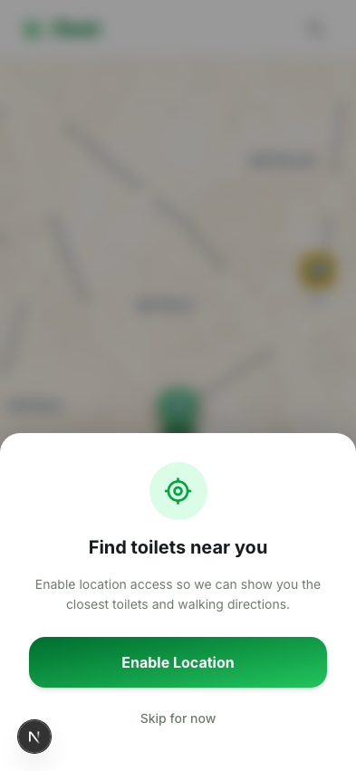
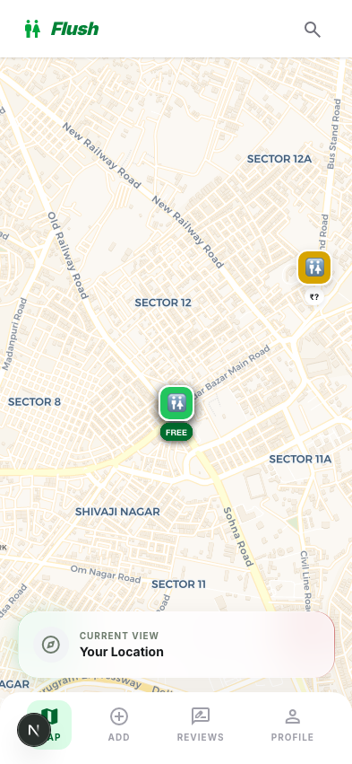
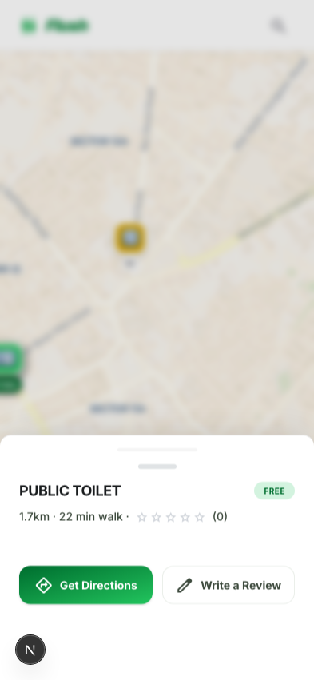

# Flush — Find a Toilet Near You

A mobile-first web app that helps people find nearby toilets with detailed amenity info and ratings. Think Google Maps, but specifically for toilets. Starting with Gurgaon, India.

## Screenshots

<p align="center">
  
  &nbsp;&nbsp;
  
  &nbsp;&nbsp;
  
</p>

## Features

- **Interactive Map** — Browse toilet locations on a CARTO Voyager map with color-coded pins (green = free, yellow = paid)
- **Nearby Search** — Finds toilets within a configurable radius using PostGIS geography queries
- **Toilet Details** — Tap a pin to see name, type, distance, walking time, amenities, and reviews in a bottom sheet
- **Emergency Mode** — "I need to go NOW" button flies you to the closest toilet within 5km
- **Add a Toilet** — 4-step flow to contribute new locations (pin drop, details, amenities, confirm)
- **Reviews & Ratings** — Leave star ratings and text reviews; average ratings update automatically
- **12 Amenity Types** — Wheelchair access, baby changing, bidets, soap, and more
- **Works Offline-ish** — Falls back to Gurgaon center if location is denied, with a clear banner

## Tech Stack

| Layer | Tech |
|-------|------|
| Frontend | Next.js 16 (App Router), TypeScript, Tailwind CSS v4 |
| UI | shadcn/ui (Drawer, Badge, Button, Card, Dialog, Toast) |
| Map | Leaflet + react-leaflet, CARTO Voyager tiles |
| Database | Supabase (Postgres + PostGIS) |
| Deployment | Vercel |
| Testing | Playwright |

## Getting Started

```bash
# Install dependencies
npm install

# Set up environment variables
cp .env.local.example .env.local
# Add your Supabase URL and publishable key

# Seed the database with Gurgaon toilet data
npm run seed

# Start dev server
npm run dev
```

Open [http://localhost:3000](http://localhost:3000) on your phone (or use mobile device emulation).

## Scripts

| Command | Description |
|---------|-------------|
| `npm run dev` | Start development server |
| `npm run build` | Production build |
| `npm run seed` | Seed Gurgaon toilet data from OpenStreetMap |
| `npm test` | Run Playwright tests |
| `npm run test:ui` | Playwright UI mode |

## License

MIT
